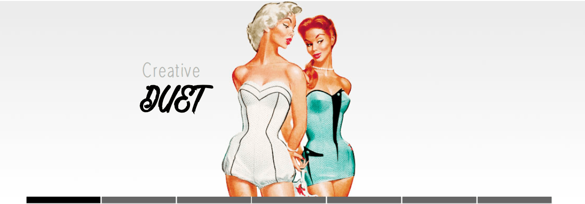
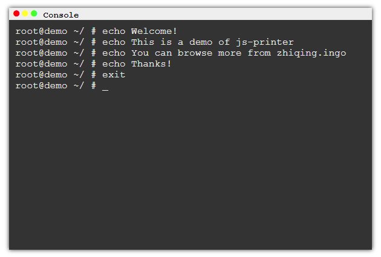
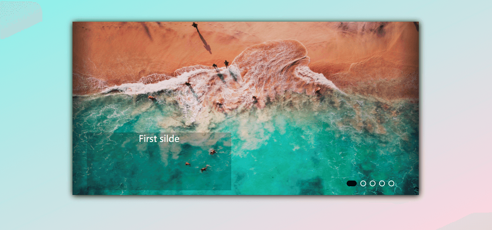
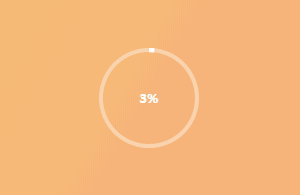

# js-demo

   **Practice makes perfect.**

## [Apple-menu](./works/Apple-menu)
> 一个利用勾股定理写出来的一个效果

## [PowerPoint](./works/PowerPoint)
> 幻灯片效果

## [js-printer](./works/js-printer)
> 打字机效果

## Slider
> 轮播图
[Slider](./works/Slider)
[Slider2](./works/Slider2)
[SliderUpDown](./works/SliderUpDown)
[Carousel](./works/Carousel)

## [loading](./works/loading)

> 多种加载效果

## [Anime](./works/anime)

> 动画效果（使用anime.js）
> 有几个是用的原生的js

## [Barrage](./works/Barrage)(未完成)

> 简易弹幕

## [3D](./works/3D)

> 3D效果（翻转、3D视差）